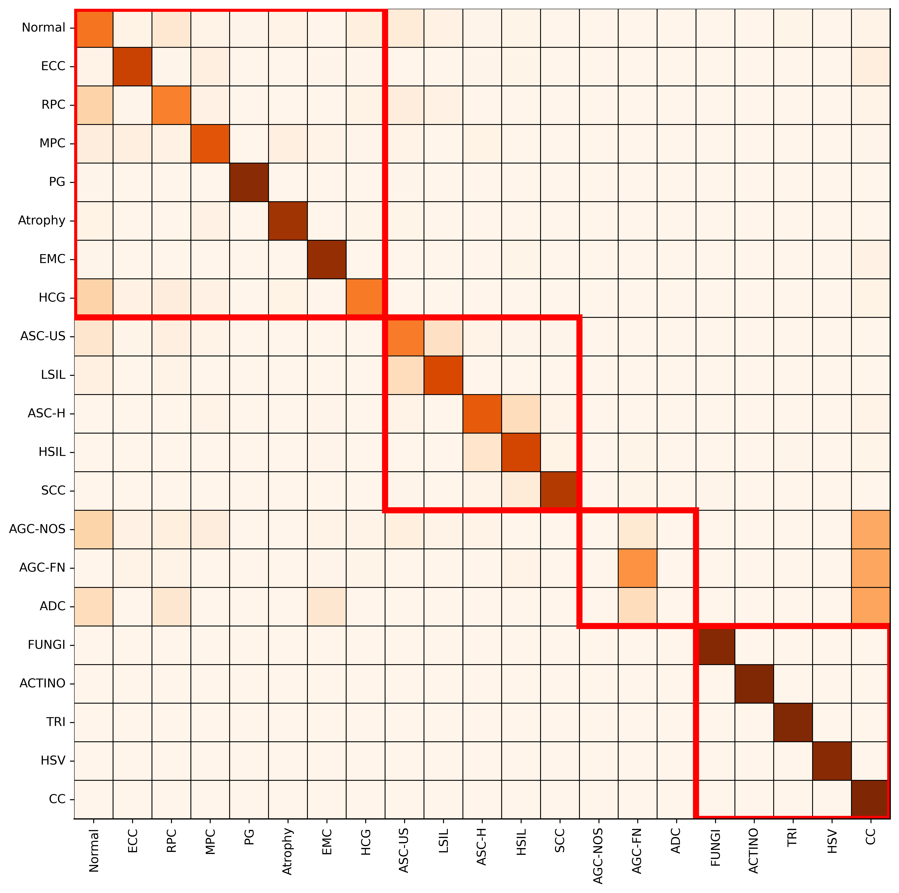
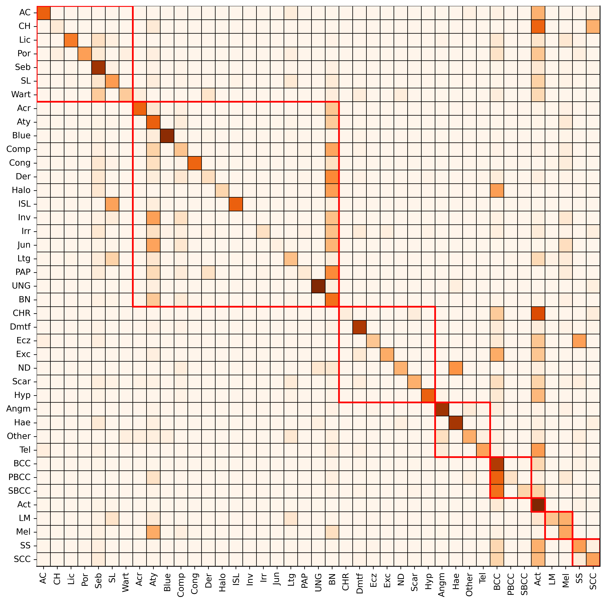
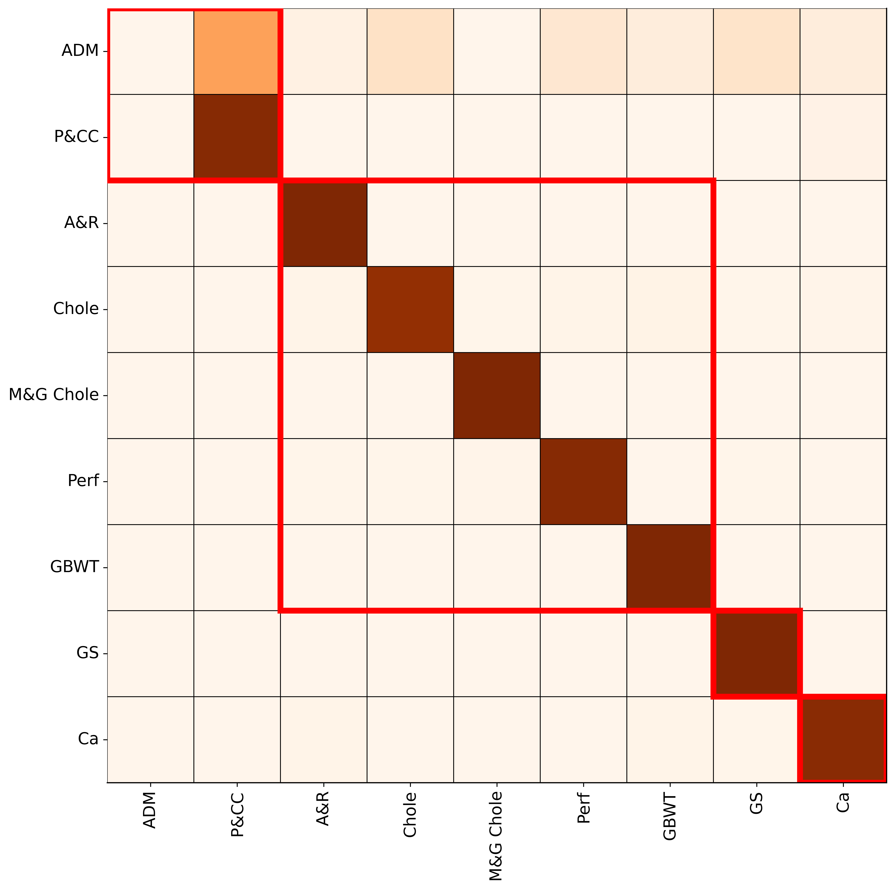

# H2CL

Paper is submitted and under review.

## Visualization results (high-resolution versions)

### HiCervix

### MoleMap

### UIdataGB

### Our model t-SNE

### Swin Transformer t-SNE (as our backbone)

